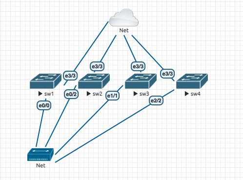

# lab1, day 1 for 1st network shell arts!

## figure




## value

sw[1-4]

management ip's are 192.168.6.100-103

id/pass/secret = pocadmin/password/password

## 1. generate initial configuration for switches by m4!

```
$ vi machines.list
$ vi sw_template.m4
$ mkdir init_config
$ cat machines.list | grep -v "^$" | awk '{print "-DHOSTNAME=\""$1"\" -DIPADDR=\""$2"\" > ./init_config/"$1".conf"}' | xargs -IXXXX sh -c "m4 XXXX sw_template.m4"
$ ls init_config/
sw1.conf  sw2.conf  sw3.conf  sw4.conf
$ grep -e "hostname " -e "ip address" init_config/sw*.conf
init_config/sw1.conf:hostname sw1
init_config/sw1.conf: ip address 192.168.6.100 255.255.255.0
init_config/sw2.conf:hostname sw2
init_config/sw2.conf: ip address 192.168.6.101 255.255.255.0
init_config/sw3.conf:hostname sw3
init_config/sw3.conf: ip address 192.168.6.102 255.255.255.0
init_config/sw4.conf:hostname sw4
init_config/sw4.conf: ip address 192.168.6.103 255.255.255.0
```

now you can see output configs in init_config directory.

## 2. configure each switches

just do it via eve-ng console

## 3. add .cloginrc files to inbound access

!! replace exists .cloginrc

!! if you'd like to use exists one, please backup before below:

```
$ export PATH=$PATH:/usr/lib/rancid/bin
$ vi lab1_login.list
add method * ssh
add user 192.168.6.100 pocadmin
add password 192.168.6.100 password password
add user 192.168.6.101 pocadmin
add password 192.168.6.101 password password
add user 192.168.6.102 pocadmin
add password 192.168.6.102 password password
add user 192.168.6.103 pocadmin
add password 192.168.6.103 password password
$ cat lab1_login.list > ~/.cloginrc
$ chmod 600 ~/.cloginrc
$ clogin 192.168.6.100
192.168.6.100
spawn ssh -x -l pocadmin 192.168.6.100
The authenticity of host '192.168.6.100 (192.168.6.100)' can't be established.
RSA key fingerprint is SHA256:ttXdvH+5+78Egsylp+/43lQzYb7sBfmX1aTH0EeniHg.
Are you sure you want to continue connecting (yes/no)? 
Host 192.168.6.100 added to the list of known hosts.
yes
Warning: Permanently added '192.168.6.100' (RSA) to the list of known hosts.
Password: 

sw1>enable
Password: 
sw1#
sw1#exit
Connection to 192.168.6.100 closed by remote host.
Connection to 192.168.6.100 closed.
```

## 4. login & type specific command to multiple switches!

```
$ cat machines.list | awk '{print $2}' | grep -v "^$" | xargs -IXXXX clogin -c "show lldp nei" XXXX
192.168.6.100
spawn ssh -x -l pocadmin 192.168.6.100
Password: 
sw1>enable
Password: 
sw1#
sw1#terminal length 0
sw1#terminal width 132
sw1#show lldp nei
Capability codes:
    (R) Router, (B) Bridge, (T) Telephone, (C) DOCSIS Cable Device
    (W) WLAN Access Point, (P) Repeater, (S) Station, (O) Other

Device ID           Local Intf     Hold-time  Capability      Port ID
sw3.example.com     Et0/0          120        R               Et1/1
sw2.example.com     Et0/0          120        R               Et0/2
sw4.example.com     Et0/0          120        R               Et2/2

Total entries displayed: 3

sw1#exit
Connection to 192.168.6.100 closed by remote host.
Connection to 192.168.6.100 closed.
192.168.6.101
spawn ssh -x -l pocadmin 192.168.6.101
The authenticity of host '192.168.6.101 (192.168.6.101)' can't be established.
RSA key fingerprint is SHA256:7chxbPlQVFzJq5ftFGWb3F7K5VIhdER3fAdqqLpKvZM.
Are you sure you want to continue connecting (yes/no)? 
Host 192.168.6.101 added to the list of known hosts.
yes
Warning: Permanently added '192.168.6.101' (RSA) to the list of known hosts.
Password: 

sw2>enable
Password: 
sw2#
sw2#terminal length 0
sw2#terminal width 132
sw2#show lldp nei
Capability codes:
    (R) Router, (B) Bridge, (T) Telephone, (C) DOCSIS Cable Device
    (W) WLAN Access Point, (P) Repeater, (S) Station, (O) Other

Device ID           Local Intf     Hold-time  Capability      Port ID
sw3.example.com     Et0/2          120        R               Et1/1
sw1.example.com     Et0/2          120        R               Et0/0
sw4.example.com     Et0/2          120        R               Et2/2

Total entries displayed: 3

sw2#exit
Connection to 192.168.6.101 closed by remote host.
Connection to 192.168.6.101 closed.
192.168.6.102
spawn ssh -x -l pocadmin 192.168.6.102
The authenticity of host '192.168.6.102 (192.168.6.102)' can't be established.
RSA key fingerprint is SHA256:At0Bb9vx6iQf9LPDzlq/VoikDACJDrAXyHJBLqpdx0I.
Are you sure you want to continue connecting (yes/no)? 
Host 192.168.6.102 added to the list of known hosts.
yes
Warning: Permanently added '192.168.6.102' (RSA) to the list of known hosts.
Password: 

sw3>enable
Password: 
sw3#
sw3#terminal length 0
sw3#terminal width 132
sw3#show lldp nei
Capability codes:
    (R) Router, (B) Bridge, (T) Telephone, (C) DOCSIS Cable Device
    (W) WLAN Access Point, (P) Repeater, (S) Station, (O) Other

Device ID           Local Intf     Hold-time  Capability      Port ID
sw2.example.com     Et1/1          120        R               Et0/2
sw1.example.com     Et1/1          120        R               Et0/0
sw4.example.com     Et1/1          120        R               Et2/2

Total entries displayed: 3

sw3#exit
Connection to 192.168.6.102 closed by remote host.
Connection to 192.168.6.102 closed.
192.168.6.103
spawn ssh -x -l pocadmin 192.168.6.103
The authenticity of host '192.168.6.103 (192.168.6.103)' can't be established.
RSA key fingerprint is SHA256:lQ2iY/SvH4IXk38Ce7ahdmczODRM3uo18af35mEbbF4.
Are you sure you want to continue connecting (yes/no)? 
Host 192.168.6.103 added to the list of known hosts.
yes
Warning: Permanently added '192.168.6.103' (RSA) to the list of known hosts.
Password: 

sw4>enable
Password: 
sw4#
sw4#terminal length 0
sw4#terminal width 132
sw4#show lldp nei
Capability codes:
    (R) Router, (B) Bridge, (T) Telephone, (C) DOCSIS Cable Device
    (W) WLAN Access Point, (P) Repeater, (S) Station, (O) Other

Device ID           Local Intf     Hold-time  Capability      Port ID
sw3.example.com     Et2/2          120        R               Et1/1
sw2.example.com     Et2/2          120        R               Et0/2
sw1.example.com     Et2/2          120        R               Et0/0

Total entries displayed: 3

sw4#exit
Connection to 192.168.6.103 closed by remote host.
Connection to 192.168.6.103 closed.
```

seems to be a little noisy? try this one:

```
$ cat machines.list | awk '{print $2}' | grep -v "^$" | xargs -IXXXX clogin -c "show lldp nei" XXXX | grep -e "#show" -e "/"
sw1#show lldp nei
sw3.example.com     Et0/0          120        R               Et1/1
sw2.example.com     Et0/0          120        R               Et0/2
sw4.example.com     Et0/0          120        R               Et2/2
sw2#show lldp nei
sw3.example.com     Et0/2          120        R               Et1/1
sw1.example.com     Et0/2          120        R               Et0/0
sw4.example.com     Et0/2          120        R               Et2/2
sw3#show lldp nei
sw2.example.com     Et1/1          120        R               Et0/2
sw1.example.com     Et1/1          120        R               Et0/0
sw4.example.com     Et1/1          120        R               Et2/2
sw4#show lldp nei
sw3.example.com     Et2/2          120        R               Et1/1
sw2.example.com     Et2/2          120        R               Et0/2
sw1.example.com     Et2/2          120        R               Et0/0
$ cat machines.list | awk '{print $2}' | grep -v "^$" | xargs -IXXXX sh -c 'clogin -c "show lldp nei" XXXX | grep -e "#show" -e "/" > ./result/XXXX'
$ ls result/
192.168.6.100  192.168.6.101  192.168.6.102  192.168.6.103
$ ls result/ | xargs -IXXXX sh -c "grep '#show' result/XXXX | awk -F# '{print \$1}' | xargs -IYYYY mv result/XXXX result/YYYY"
$ ls result/
sw1  sw2  sw3  sw4
$ cd result/
$ ls | grep ^sw | xargs -IXXXX sh -c 'cat XXXX | grep "/" | sed "s/.example.com//g" | awk "{print \$1\" \"\$2\" <> XXXX \"\$2}"' | sort
sw1 Et0/2 <> sw2 Et0/2
sw1 Et1/1 <> sw3 Et1/1
sw1 Et2/2 <> sw4 Et2/2
sw2 Et0/0 <> sw1 Et0/0
sw2 Et1/1 <> sw3 Et1/1
sw2 Et2/2 <> sw4 Et2/2
sw3 Et0/0 <> sw1 Et0/0
sw3 Et0/2 <> sw2 Et0/2
sw3 Et2/2 <> sw4 Et2/2
sw4 Et0/0 <> sw1 Et0/0
sw4 Et0/2 <> sw2 Et0/2
sw4 Et1/1 <> sw3 Et1/1
```

maybe we should rid of the example.com in some way (actually, we can `no ip domain` when after ssh key generated)